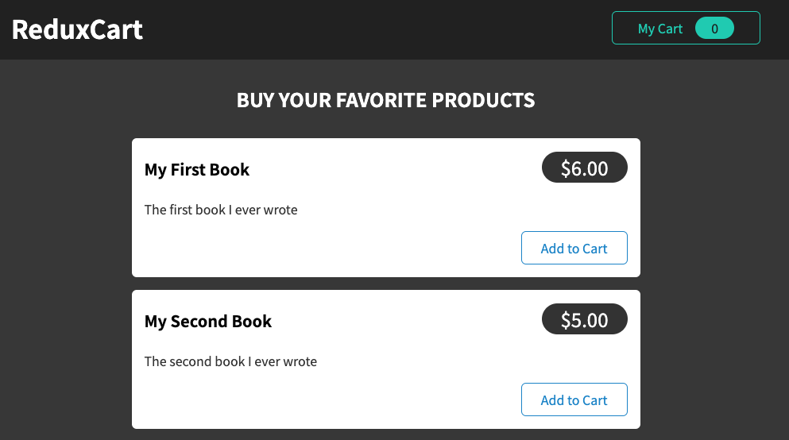
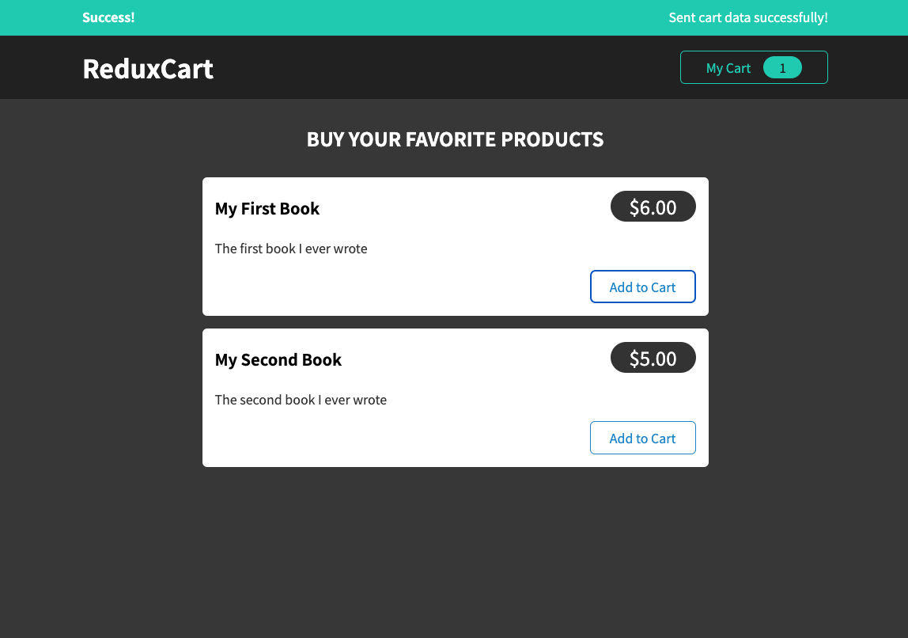
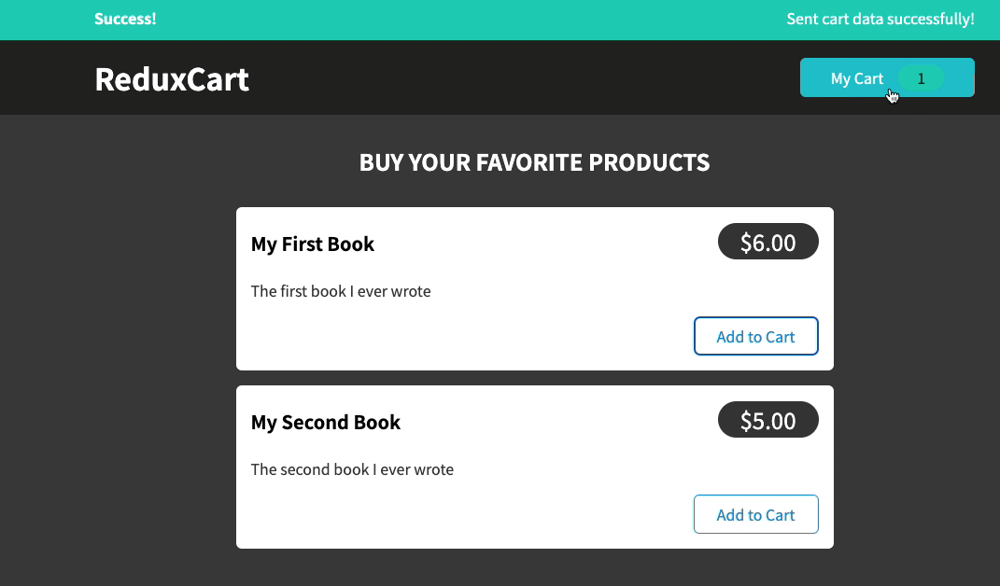
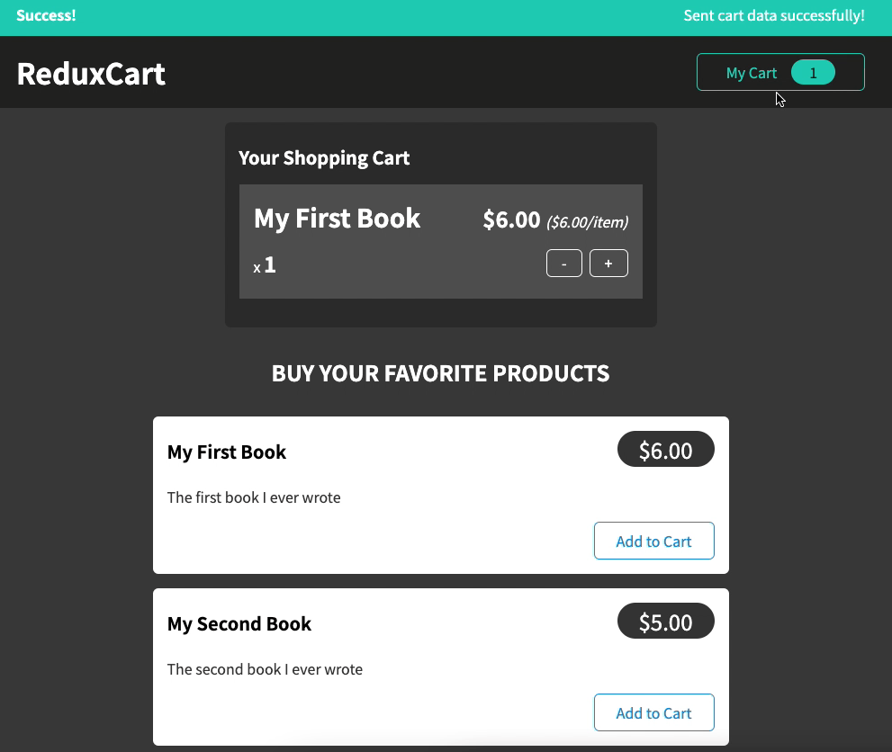
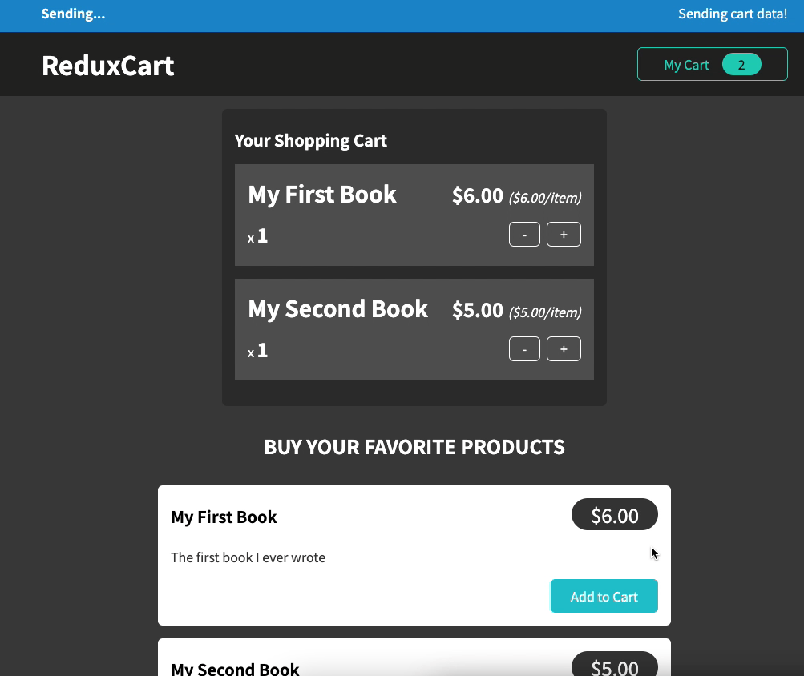
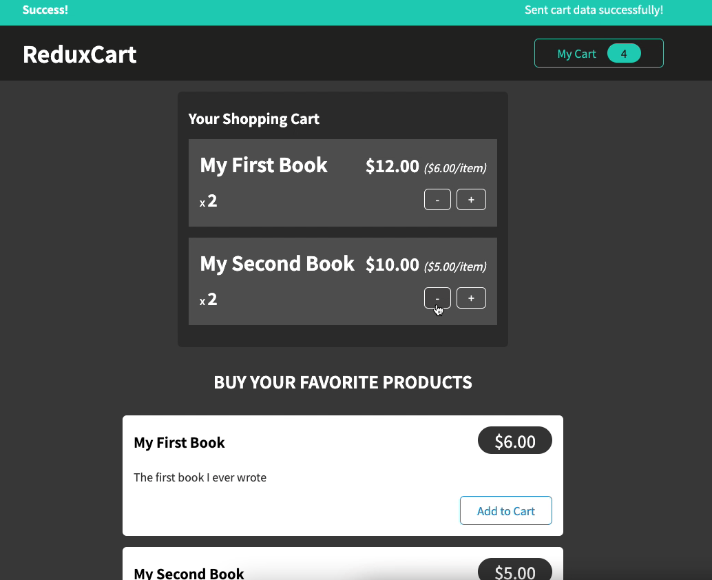
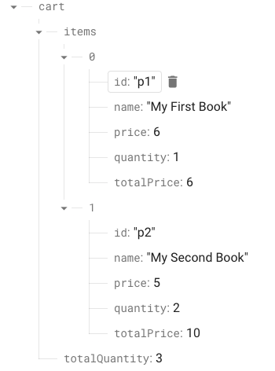

# Shopping Mall - Cart


* #### writer : crystal Lee

* #### written at : 2022-09 

* #### source : [Udemy] React Perfect Guide Sec.19

---

* <strong>Skills</strong>
    * React 
    * Redux-toolkit

<br>

* <strong>What I learn</strong>
    * useState  
    * useEffect  
    * useDispatch
    * useSelector 
    * Redux-toolkit
        * createSlice
        * configureStore
    <br />
    * Firebase
    <br />
    * Where Should I put ```side effects``` and ```asynchronouse codes``` with ```redux```?
        (1) In the ```reducers``` : Never !
        (2) In the ```components``` : Not recommended
        (3) In the ```action creators``` : Highly recommended

<br>

* <strong>Features</strong>
    * Item List 
        * Item Information
        * Add to Cart Button
    * Cart 
        * Show Cart When Clicked (Toggling)
        * Show TotalQuantity 
        * Show 'Added Item List' & 'Total Amount'
        * Minus & Plus Buttons for Cart
    * Notification Bar
        * In Process 
        * Success
        * Error

<br />

(1) 기본 화면 (isCartVisible:false)


(2) 카트에 상품이 1개 담겼을 때 (isCartVisible:false)


(3-1) 카트 toggling (isCartVisible:false)


(3-2) 카트 toggling (isCartVisible:true)


(4) 상품을 카트에 담았을 때 : Notification Bar 


(5) 카트에서 상품의 Minus & Plus 버튼 조작


(6) Firebase RDBMS 연동 
